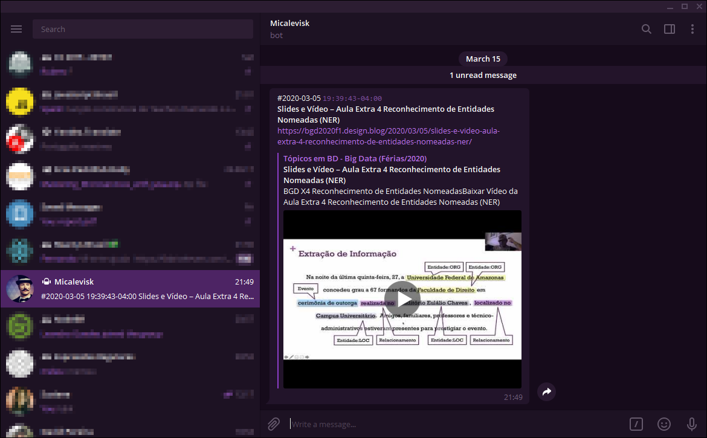

# scrap-and-notify

O objetivo deste repositório é usar a feature GitHub Actions para "notificar" quando uma nova publicação for publicada em https://bgd2020f1.design.blog  
Um bot do Telegram enviará a **data**, o **horário**, o **nome** e o **link** da última publicação para um usuário ou canal em que ele já foi iniciado. Contudo, essa notificação só será feita se essa publicação já não tiver sido enviada.

## Como funciona?

A lógica implementada pelo workflow [run](./.github/workflows/run.yml) em seu único job é a seguinte:  
Todo web scrapper gerado pelo script [`scrap`](./scripts/scrap.js) na página alvo será salvo no arquivo `last-article.json`. Um _checksum_ será gerado usando somente os valores (não _keys_) desse JSON e salvo no arquivo `checksum.md5`. Esses dois arquivos farão parte do artefato produzido no final do workflow. Assim, na próxima execução do job, o conteúdo do **último artefato produzido** no repositório será usado para comparar com o novo _checksum_ produzido pela nova execução do scrapper e, caso não seja o mesmo _checksum_ ou não exista um **último atertato**, significa que houve uma nova publicação na página alvo. O conteúdo do arquivo `last-article.json` será usado para compor a mensagem que o bot enviará para o chat alvo. O script [`notify`](./scripts/notify.js) é o responsável pelo envio da mensagem. Essa mensagem é construída na [última etapa do job](./.github/workflows/run.yml#L105), usando o [jq](https://stedolan.github.io/jq).

Além disso, uma etapa garante que existirá apenas um artefato no repositório.

## Como usar?

1. Clone ou realize um <kbd>Fork</kbd> deste repositório
2. No seu repositório, defina as seguintes variáveis de ambiente em **Settings > Secrets**:
    1. `TELEGRAM_BOT_TOKEN` com o valor obtido ao criar um bot do Telegram via [@BotFather](https://t.me/BotFather)
    2. `TELEGRAM_CHAT_ID` com o valor do seu chat id ou nome do canal (iniciando com `@`) que receberá as mensagens de "notificação". O chat_id pode ser obtido conversando com o bot [@chatid_echo_bot](https://t.me/chatid_echo_bot)
    3. opcionalmente, definir `TARGET_BLOG` caso a página tenha mudado de endereço mas o markup continuar o mesmo
    4. e, opcionalmente, `PAGE_TITLE` para definir o título da página alvo. Como uma forma de garantir que scrap está sendo executado na página certa. Essa lógica está implementada no arquivo [`./scripts/scrap/scrap.js`](./scripts/scrap.js#L7-L9)
3. Inicie uma conversa com o seu bot para que ele possa te as enviar mensagens. Um `/start` basta
4. Confirme que **as Actions estão ativadas** no seu repositório, em **Settings > Actions**. Se for um repositório privado, verifique os limites de execução das GH Actions em https://github.com/settings/billing

Você pode alterar a _cron schedule expression_ no arquivo YAML do workflow: [`.github/workflow/run.yml`](./.github/workflows/run.yml) (use https://crontab.guru).

Defina a variável `ACTIONS_STEP_DEBUG` igual a `true` em **Settings > Secrets** para mostrar os prints de debug no painel **Actions**.

## Referências

- [GitHub Actions](https://github.com/features/actions)
- [GitHub Actions artifacts](https://developer.github.com/v3/actions/artifacts)
- action para recuperar o conteúdo do último artefato no repositório: [micalevisk/last-artifact-action](https://github.com/micalevisk/last-artifact-action)
- action para acessar valores de um JSON: [gr2m/get-json-paths-action](https://github.com/gr2m/get-json-paths-action)
- action para executar códigos com o Nodejs: [actions/setup-node](https://github.com/actions/setup-node)
- action para produzir um artefato no workflow: [actions/upload-artifact](https://github.com/actions/upload-artifact)
- action para apagar todos os artefatos: [kolpav/purge-artifacts-action](https://github.com/kolpav/purge-artifacts-action)
